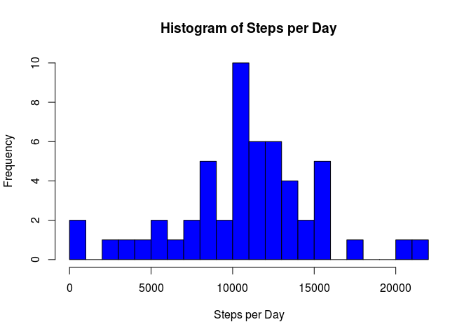
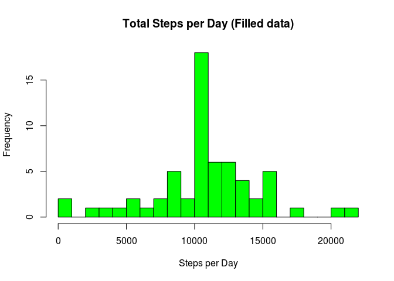
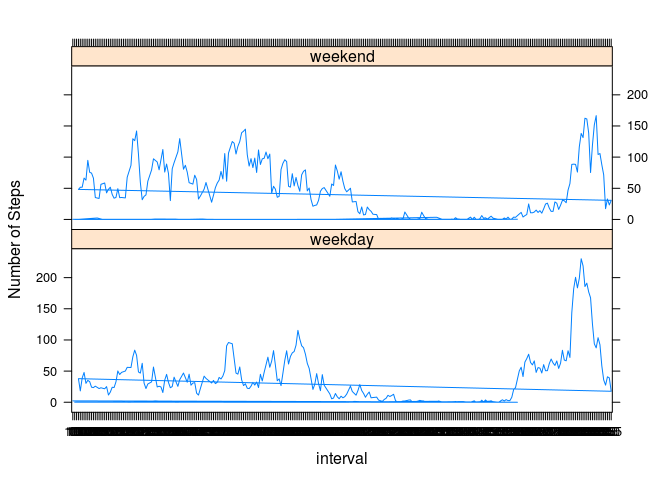

# Reproducible Research: Peer Assessment 1


## Loading and preprocessing the data
dt will be the raw data  
dd will be the cleaned data without NA's


```r
library(data.table)
unzip("activity.zip")
dt <- read.csv("activity.csv", colClasses=c("numeric", "character", "numeric"))
dd <- dt[complete.cases(dt),]
```

## What is mean total number of steps taken per day?


```r
steps_per_day <- sapply(with(dt, split(steps, date)), sum)
hist(steps_per_day, breaks=20, col="blue",
     main="Histogram of Steps per Day", xlab="Steps per Day")
```

 

```r
median(steps_per_day, na.rm=T)
```

```
## [1] 10765
```

```r
mean(steps_per_day, na.rm=T)
```

```
## [1] 10766
```

## What is the average daily activity pattern?


```r
activity_mean <- sapply(with(dd, split(steps, interval)), mean)
plot(activity_mean ~ names(activity_mean), type="l",
     main="Daily Activity Pattern",
     xlab="Time of Day", ylab="Average Steps Taken")
```

 

The 5 minute interval with the maximum number of steps. (interval=first line, max_steps=second line)

```r
tail(sort(sapply(with(dd, split(steps, interval)), sum)), n=1)
```

```
##   835 
## 10927
```

## Inputing missing values

Total missing values, NA, in the dataset.

```r
summary(dt$steps)["NA's"]
```

```
## NA's 
## 2304
```

To fill in the missing values we will use the mean of the interval over all the
days rounded to the nearest integer, from the cleaned data.

```r
intervals <- sapply(sapply(with(dd, split(steps, interval)), mean), round)
```

Create a new copy of the raw data and fill in the NAs with the values from the
intervals vector by name.

```r
full <- copy(dt)
for(i in which(is.na(dt$steps))) {
    full[i,1] <- intervals[[as.character(dt[i,3])]]
}
```

Note the differing mean and medians compared to the raw data.

```r
full_steps_per_day <- sapply(with(full, split(steps, date)), sum)
hist(full_steps_per_day, breaks=20, col="green",
     main="Total Steps per Day (Filled data)", xlab="Steps per Day")
```

 

```r
c(mean(full_steps_per_day), mean(steps_per_day, na.rm=T))
```

```
## [1] 10766 10766
```

```r
c(median(full_steps_per_day), median(steps_per_day, na.rm=T))
```

```
## [1] 10762 10765
```

Notice how the filled data skews the mean and median lower, since there are more values now.

## Are there differences in activity patterns between weekdays and weekends?


```r
day_of_week <- weekdays(as.Date(full$date, format="%Y-%m-%d"))
weekdays = c('Monday', 'Tuesday', 'Wednesday',
             'Thursday', 'Friday')
weekends = c('Saturday', 'Sunday')
day_of_week[day_of_week %in% weekdays] <- 1
day_of_week[day_of_week %in% weekends] <- 2
day_of_week <- sapply(day_of_week, as.numeric)
names(day_of_week) <- NULL
full$week <- day_of_week
wda <- sapply(with(subset(full, week==1, select=c(steps, interval)),
                   split(steps, interval)), mean)
wea <- sapply(with(subset(full, week==2, select=c(steps, interval)),
                   split(steps, interval)), mean)
df <- data.frame(activity=as.vector(wda), interval=as.character(names(wda)),
                 week=rep(1, length(wda)))
df <- rbind(df, data.frame(activity=as.vector(wea), interval=as.character(names(wea)),
                       week=rep(2, length(wea))))
data <- transform(df, week=factor(week, labels=c("weekday", "weekend")))
library(lattice)
xyplot(activity ~ interval | week, data=data, type="l", layout=c(1,2),
       ylab="Number of Steps")
```

 
